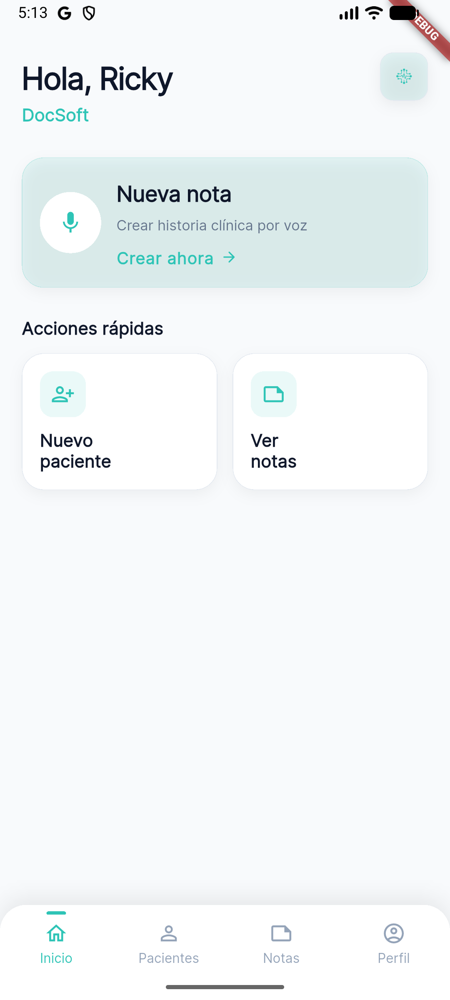
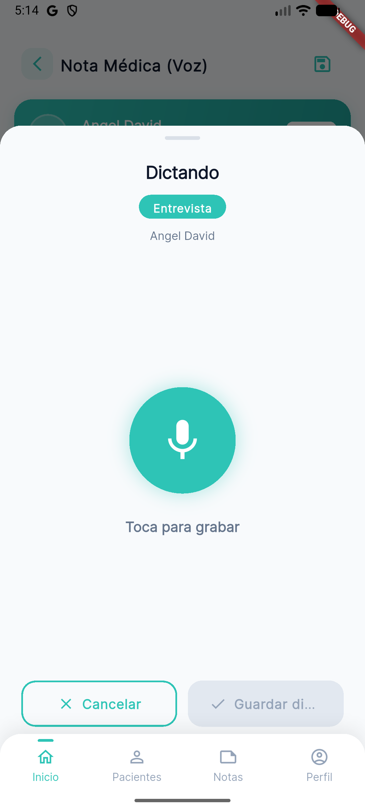
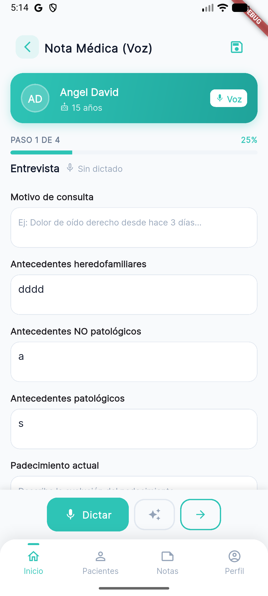
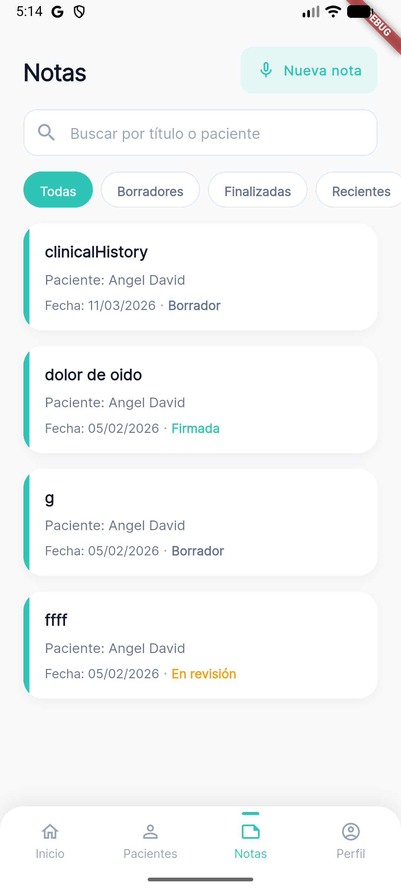
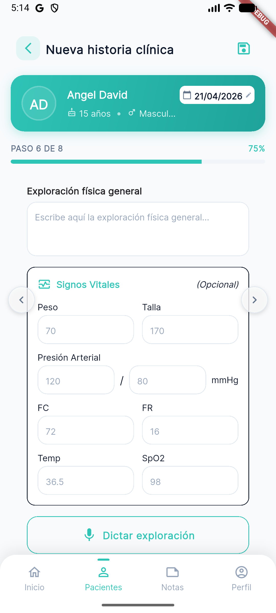
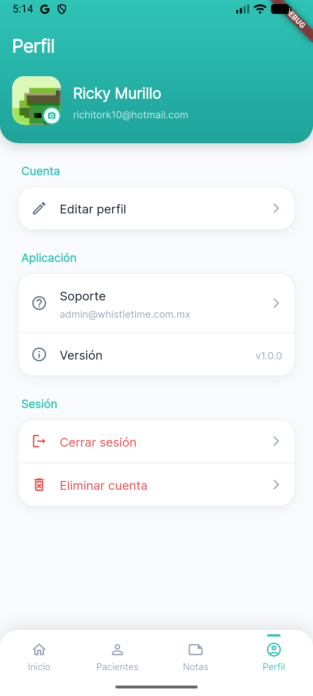
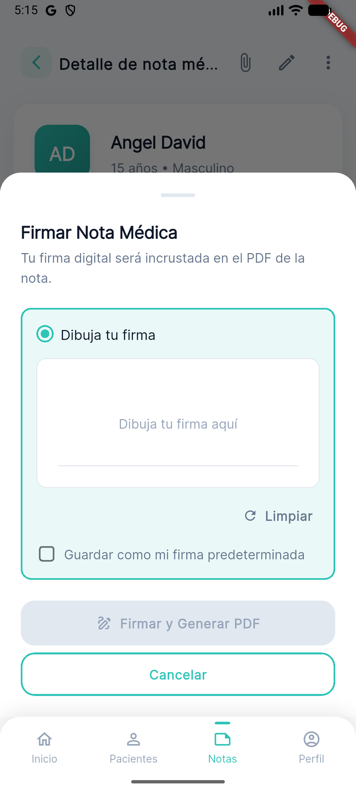

# 🩺 DocSoft – Medical Notes Management System

<p align="center">
  
</p>

DocSoft is a modern medical notes management platform designed to streamline the creation, organization, and accessibility of clinical documentation.

---

## 🚀 Features

* 📝 Manual medical note creation
* 🎙️ Voice dictation for clinical notes
* 👥 Patient management system
* 📂 Organized notes history
* 🔬 Physical exploration module
* ✍️ Digital note signing
* 📤 PDF export and sharing
* 🌐 Cross-platform (Mobile + Web)

---

## 📸 App Screens

### 🎙️ Voice Dictation

<p align="center">
  
</p>

---

### 📝 Medical Note (Voice Input)

<p align="center">
  
</p>

---

### 📋 Notes Management

<p align="center">
  
</p>

---

### 👥 Patients Module

<p align="center">
  
</p>

---

### 🔬 Physical Exploration

<p align="center">
  
</p>

---

### 👤 Profile

<p align="center">
  
</p>

---

### 📤 Share PDF

<p align="center">
  
</p>

---

### ✍️ Sign Note

<p align="center">
  
</p>

---

## 🧠 Architecture

This project follows **Clean Architecture**:

* Presentation Layer (UI + BLoC)
* Domain Layer (Business Logic)
* Data Layer (Repositories & APIs)

---

## 🛠️ Tech Stack

* Flutter (Mobile & Web)
* Node.js (Backend)
* BLoC (State Management)
* Voice-to-text integration

---

## 📦 Project Structure

```bash
assets/
  screenshots/
lib/
  data/
  domain/
  presentation/
```

---

## ⚙️ Getting Started

```bash
git clone https://github.com/rickyma18/ent-voice-notes-app
cd ent-voice-notes-app
flutter pub get
flutter run
```

---

## 👨‍💻 Author

**Ricardo Murillo**
Software Engineer | Cybersecurity | Flutter Developer

---

## 📄 License

MIT License
